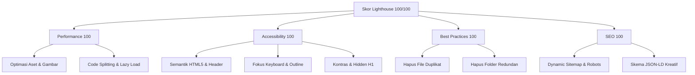

# Panduan Optimasi Lighthouse Rata Kanan (100/100)

Dokumen ini berisi analisis menyeluruh terhadap seluruh kode portofolio Next.js dan daftar rekomendasi tindakan optimasi industri untuk mencapai skor sempurna (100/100) pada Google Lighthouse untuk semua kategori: **Performance**, **Accessibility**, **Best Practices**, dan **SEO**, dengan tetap mempertahankan desain visual premium dan animasi GSAP/ScrollTrigger yang ada.

---

## Ringkasan Temuan Utama



---

## 1. PERFORMANCE (Optimasi Kecepatan & LCP)

### 1.1. Konversi Format & Kompresi Gambar
Aset gambar saat ini menggunakan format `.png` dan `.jpg` mentah dengan ukuran file yang sangat besar. Ini adalah penghambat terbesar pada First Contentful Paint (FCP) dan Largest Contentful Paint (LCP).

* **Aset-aset berikut sangat disarankan untuk dikompresi dan dikonversi ke format WebP atau AVIF:**
  - `public/assets/Hero/Hero_bg_hover.png` (~3.4 MB) &rarr; Konversi ke `.webp` (target ukuran ~250 KB)
  - `public/assets/Hero/Hero_bg.png` (~1.2 MB) &rarr; Konversi ke `.webp` (target ukuran ~150 KB)
  - `public/assets/Hero/Hero.png` (~687 KB) &rarr; Konversi ke `.webp` (target ukuran ~80 KB)
  - `public/assets/Hero/Hero_Hover.png` (~861 KB) &rarr; Konversi ke `.webp` (target ukuran ~100 KB)
  - `public/assets/IMG_0304.JPG` (~894 KB) &rarr; Ubah ke `.webp` (target ukuran ~90 KB)
  - `public/assets/mpkosis.png` (~1.05 MB) &rarr; Ubah ke `.webp` (target ukuran ~120 KB)

**Langkah Implementasi:**
1. Konversi gambar di atas menggunakan tool CLI seperti `sharp` atau tool online.
2. Setelah file WebP siap di folder `public/assets/`, perbarui path gambar di:
   - `src/components/Hero.tsx`
   - `src/components/About.tsx`
   - `src/components/Projects.tsx`

---

### 1.2. Optimasi SVG Berat (Logo_sider.svg)
File `public/assets/Logo_sider.svg` berukuran **2.56 MB**. Penyebab utama ukuran ini sangat besar adalah adanya data gambar PNG beresolusi tinggi (2508x2508 px) yang di-*embed* dalam bentuk teks base64 di baris pertama SVG tersebut:
```xml
<image x="0" y="0" width="2508" xlink:href="data:image/png;base64,iVBORw0KGgoAAAANS..." />
```
Ini sangat membebani pemrosesan halaman pada browser (Total Blocking Time).

**Rekomendasi Tindakan:**
- Buat ulang SVG tersebut agar menggunakan bentuk vector murni (path), ATAU
- Ekstrak base64 PNG tersebut menjadi file `.webp` eksternal terpisah (kompres hingga < 50 KB), lalu gunakan tag `<Image>` Next.js untuk merendernya secara efisien.

---

### 1.3. Ganti Tag `` Mentah dengan `<Image>` Next.js
Ada beberapa tag `` html murni yang digunakan untuk menampilkan gambar dinamis atau logo eksternal. Menggunakan `` murni dapat menyebabkan Layout Shift (CLS) dan menghambat pemuatan malas (lazy loading).

* **Ubah tag `` murni menjadi komponen `<Image>` dari `next/image` pada berkas berikut:**
  - **About.tsx (Foto profil)** pada baris [About.tsx:L102-106](file:///c:/Users/Rislan/AppData/Local/Temp/portofolio/src/components/About.tsx#L102-106):
    ```diff
    - 
    + <Image
    +   src="/assets/IMG_0304.webp"
    +   alt="M Rislan Tristansyah"
    +   fill
    +   sizes="(min-width: 768px) 112px, 96px"
    +   className="w-full h-full object-cover object-center"
    +   priority
    + />
    ```
  - **About.tsx (Logo Pendidikan & Pengalaman)** pada baris [About.tsx:L216](file:///c:/Users/Rislan/AppData/Local/Temp/portofolio/src/components/About.tsx#L216) & [About.tsx:L244](file:///c:/Users/Rislan/AppData/Local/Temp/portofolio/src/components/About.tsx#L244).
  - **Projects.tsx (Logo Tech Stack Card)** pada baris [Projects.tsx:L273-277](file:///c:/Users/Rislan/AppData/Local/Temp/portofolio/src/components/Projects.tsx#L273-277).

---

### 1.4. Code Splitting & Dynamic Imports
Beberapa pustaka animasi client-side berukuran besar (GSAP, Lenis, Three.js) dimuat di halaman utama. Pustaka ini dapat menaikkan Total Blocking Time (TBT) saat parsing JavaScript.
- Gunakan `next/dynamic` untuk mengimpor komponen yang menggunakan Three.js (`InkCanvas` dan `ClientOnlyCustomCursor` sudah menggunakan dynamic import, ini praktik yang bagus!).
- Jaga agar semua logika inisialisasi visual yang berat di dalam `useEffect` client agar tidak memblokir server-side rendering (SSR) dan hidrasi awal.

---

## 2. ACCESSIBILITY (A11Y)

Untuk mendapatkan skor a11y sempurna (100/100), kita perlu memastikan navigasi keyboard dan pembaca layar (screen reader) mengenali struktur halaman dengan baik.

### 2.1. Tambahkan Outline Fokus Keyboard (`:focus-visible`)
Interactive elements (seperti tombol burger di Navbar, tautan media sosial, serta kartu proyek) saat ini tidak memiliki indikator fokus keyboard yang jelas saat ditekan menggunakan tombol Tab.

**Rekomendasi Tindakan:**
Tambahkan kelas focus-ring Tailwind CSS ke seluruh tombol dan link:
```html
focus-visible:outline-none focus-visible:ring-2 focus-visible:ring-offset-2 focus-visible:ring-accent
```
Contoh pada tombol burger di [Navbar.tsx](file:///c:/Users/Rislan/AppData/Local/Temp/portofolio/src/components/Navbar.tsx#L70-L81):
```diff
  <button
    id="navbar-burger-btn"
    onClick={() => setMenuOpen(!menuOpen)}
    aria-label="Toggle menu"
-   className={`fixed top-6 right-6 md:right-8 z-50 flex items-center justify-center w-12 h-12 rounded-full border transition-all duration-300 ${
+   className={`fixed top-6 right-6 md:right-8 z-50 flex items-center justify-center w-12 h-12 rounded-full border transition-all duration-300 focus-visible:outline-none focus-visible:ring-2 focus-visible:ring-offset-2 focus-visible:ring-accent ${
```

---

### 2.2. Gunakan Elemen Landmark Semantik (`<header>`)
Saat ini, navigasi di [Navbar.tsx](file:///c:/Users/Rislan/AppData/Local/Temp/portofolio/src/components/Navbar.tsx) langsung me-render tombol burger dan elemen `<nav>` tanpa adanya pembungkus semantik `<header>`. Halaman utama sebaiknya memiliki sebuah landmark `<header>` di bagian atas.

**Rekomendasi Tindakan:**
Bungkus struktur navigasi awal atau jadikan Navbar sebagai `<header>` agar ramah bagi screen reader:
```tsx
return (
  <header>
    {/* Burger button & nav overlay */}
  </header>
);
```

---

### 2.3. Struktur Judul (Heading Hierarchy) & Hidden H1
Struktur judul di halaman utama saat ini dimulai dengan `<h1>` pada bagian tanda tangan calligraphy visual "Rislan" di [Hero.tsx](file:///c:/Users/Rislan/AppData/Local/Temp/portofolio/src/components/Hero.tsx#L535):
```tsx
<h1 className="hero-signature ...">Rislan</h1>
```
Kata "Rislan" saja kurang deskriptif secara SEO dan kegunaan (accessibility).

**Rekomendasi Tindakan:**
1. Tambahkan `<h1>` tersembunyi secara visual (menggunakan kelas screen-reader murni `sr-only`) di bagian atas tag `<main>` di [page.tsx](file:///c:/Users/Rislan/AppData/Local/Temp/portofolio/src/app/page.tsx) yang memuat nama lengkap dan profesi utama untuk SEO crawler & pembaca layar:
   ```html
   <h1 className="sr-only">M Rislan Tristansyah - Creative Developer & AI Enthusiast Portfolio</h1>
   ```
2. Ubah tag `<h1>` visual di tanda tangan signature `Hero.tsx` menjadi `<span>` atau `<div aria-hidden="true">` karena itu murni elemen dekorasi visual kaligrafi.

---

### 2.4. Alternatif Teks untuk Tautan Ikonik (Icon Links)
Di dalam [About.tsx](file:///c:/Users/Rislan/AppData/Local/Temp/portofolio/src/components/About.tsx) (baris 148-195), tautan media sosial (LinkedIn, Credly, GitHub, Medium) hanya berisi elemen `<svg>`. Lighthouse akan mendeteksi tautan ini tidak memiliki nama yang dapat dibaca (accessible name).

**Rekomendasi Tindakan:**
Tambahkan tulisan tersembunyi `sr-only` di dalam masing-masing tautan tersebut:
```html
<a href="..." target="_blank" rel="noopener noreferrer" title="LinkedIn">
  <svg>...</svg>
  <span className="sr-only">LinkedIn Profile</span>
</a>
```

---

## 3. BEST PRACTICES (Kerapihan Kode & Konsistensi)

### 3.1. Hapus Berkas Layout Duplikat
Next.js mendeteksi adanya dua berkas tata letak utama yang saling berbenturan di folder `src/app/`:
- `layout.tsx` (Berkas utama proyek dengan konfigurasi lengkap)
- `layout.js` (Berkas default JS kosong bawaan inisialisasi)

**Rekomendasi Tindakan:**
- Hapus berkas [layout.js](file:///c:/Users/Rislan/AppData/Local/Temp/portofolio/src/app/layout.js) karena duplikat dan akan menimbulkan peringatan atau kegagalan saat menjalankan `npm run build`.

---

### 3.2. Hapus Folder Kosong / Redundan
Terdapat folder kosong bernama `src/app/project/[slug]/` di workspace.
Next.js sudah memiliki folder utama `/projects/[slug]` untuk menangani case study proyek, dan pengalihan (redirect) juga sudah diatur di `next.config.ts`:
```ts
{
  source: "/project/:slug",
  destination: "/projects/:slug",
  permanent: false,
}
```
**Rekomendasi Tindakan:**
- Hapus seluruh folder kosong [src/app/project](file:///c:/Users/Rislan/AppData/Local/Temp/portofolio/src/app/project) untuk merapikan struktur proyek.

---

## 4. SEO (Optimasi Pencarian)

### 4.1. Pembuatan Dynamic Sitemap & Robots.txt
Next.js mempermudah pembuatan berkas `sitemap.xml` dan `robots.txt` secara dinamis yang akan di-build saat compile.

**Rekomendasi Tindakan:**
1. Buat berkas baru `src/app/sitemap.ts`:
   ```ts
   import type { MetadataRoute } from "next";
   import { publishedProjects } from "@/lib/projects";

   export default function sitemap(): MetadataRoute.Sitemap {
     const baseUrl = process.env.NEXT_PUBLIC_SITE_URL || "https://rislantristansyah.my.id";
     
     const projectUrls = publishedProjects.map((p) => ({
       url: `${baseUrl}/projects/${p.slug}`,
       lastModified: new Date(),
       changeFrequency: "monthly" as const,
       priority: 0.7,
     }));

     return [
       {
         url: baseUrl,
         lastModified: new Date(),
         changeFrequency: "weekly",
         priority: 1.0,
       },
       {
         url: `${baseUrl}/projects`,
         lastModified: new Date(),
         changeFrequency: "weekly",
         priority: 0.8,
       },
       ...projectUrls,
     ];
   }
   ```
2. Buat berkas baru `src/app/robots.ts`:
   ```ts
   import type { MetadataRoute } from "next";

   export default function robots(): MetadataRoute.Robots {
     const baseUrl = process.env.NEXT_PUBLIC_SITE_URL || "https://rislantristansyah.my.id";
     return {
       rules: {
         userAgent: "*",
         allow: "/",
         disallow: "/admin/",
       },
       sitemap: `${baseUrl}/sitemap.xml`,
     };
   }
   ```

---

## 5. Rencana Tindakan & Daftar Periksa (Checklist)

Berikut adalah daftar periksa prioritas pengerjaan untuk mencapai hasil optimal:

- [ ] **Prioritas 1: Optimasi Aset Gambar**
  - [ ] Konversi gambar Hero (`Hero.png`, `Hero_bg.png`, `Hero_bg_hover.png`, `Hero_Hover.png`) ke WebP.
  - [ ] Tracing / perkecil ukuran `Logo_sider.svg`.
  - [ ] Konversi `IMG_0304.JPG` dan `mpkosis.png` ke WebP.
- [ ] **Prioritas 2: Pembenahan Kode UI**
  - [ ] Ganti tag `` murni dengan `<Image>` Next.js di `About.tsx` dan `Projects.tsx`.
  - [ ] Tambahkan indikator fokus `:focus-visible` di `Navbar.tsx` dan link media sosial.
  - [ ] Wrap Navigasi menggunakan tag `<header>`.
  - [ ] Tambahkan `<h1>` dengan kelas `sr-only` pada halaman utama.
  - [ ] Tambahkan teks `sr-only` pada tautan ikonik.
- [ ] **Prioritas 3: Kebersihan Berkas & SEO**
  - [ ] Hapus berkas redundan `src/app/layout.js`.
  - [ ] Hapus folder kosong `src/app/project/`.
  - [ ] Buat berkas `sitemap.ts` dan `robots.ts` di folder `src/app/`.
